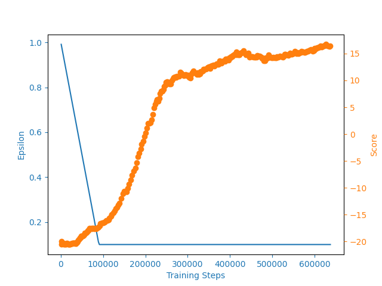

# Deep_Q-Learning

  

This repository demonstrates different implementations of Q-learning algorithms from basic to advanced deep learning architectures.

## Table of contents

- [Q-Learning Basics](#q-learning-basics)
- [Q-Learning with GYM](#q-learning-with-gym)
- [DQN with GYM](#dqn-with-gym)
- [Human-level DRL](#human-level-drl)
- [DDQN-based RL](#ddqn-based-rl)
- [D3QN](#d3qn)

## Q-Learning Basics

Q-Learning is a fundamental Reinforcement Learning (RL) algorithm that enables agents to learn optimal actions through interaction with an environment. It belongs to the class of temporal difference (TD) learning methods and is model-free, meaning it doesn't require knowledge of the environment's dynamics. Here are the key concepts:

- **Q-Value**: The Q-value, denoted as $Q(s,a)$, represents the expected cumulative reward of taking action $a$ in state $s$ and following the optimal policy thereafter.

- **Objective**: The goal is to learn the optimal action-value function $Q^\star(s,a)$ that maximizes the expected return for each state-action pair.

The Q-Learning algorithm involves the following components:

1. **Value Function Representation**:

   - The Q-values are typically stored in a table (for discrete state-action spaces) or approximated using function approximators like neural networks (for continuous or large state spaces).
   - The optimal Q-value function satisfies the Bellman optimality equation:

$$
Q^\star(s,a) = \mathbb{E}[R_t + \gamma \max_{a'} Q^\star(S_{t+1}, a') | S_t = s, A_t = a]
$$

2. **Learning Process**:

   - Q-Learning uses an iterative update rule to learn the optimal Q-values:

$$
Q(s_t, a_t) \leftarrow Q(s_t, a_t) + \alpha [r_t + \gamma \max_a Q(s_{t+1}, a) - Q(s_t, a_t)]
$$

where:

- $\alpha$ is the learning rate
- $\gamma$ is the discount factor
- $r_t$ is the immediate reward
- $s_t$ and $a_t$ are the current state and action
- $s_{t+1}$ is the next state

3. **Exploration vs Exploitation**:

   - The agent balances exploration (trying new actions) and exploitation (choosing the best known actions) using strategies like $\epsilon$-greedy:

$$
\pi(s) = \text{random action with probability } \epsilon \text{, or } \arg\max_a Q(s,a) \text{ with probability } 1-\epsilon
$$

The following implementations demonstrate different approaches to Q-Learning, from basic tabular methods to more advanced deep Q-learning techniques.

## [Q-Learning with GYM](#q-learning-with-gym)

This implementation applies Q-Learning to the FrozenLake-v0 environment from OpenAI's Gym. The FrozenLake environment presents a grid-world navigation problem where an agent must traverse a frozen lake from start to goal while avoiding holes. The implementation uses a tabular approach with a dictionary-based Q-table, making it suitable for this discrete state-action space environment. The Q-values are updated iteratively using the Q-Learning update rule, which combines immediate rewards with discounted future rewards to learn optimal action values.

### Algorithm

The Q-Learning algorithm for this implementation follows these steps:

---

1.  Initialize Q-values for all state-action pairs to zero.
2.  For each episode:
    a. Reset the environment to initial state $s_0$.
    b. For each time step until the episode ends:

    i. Select action $a_t$ using $\epsilon$-greedy policy: - With probability $\epsilon$: choose random action - With probability $1-\epsilon$: choose action with highest Q-value

    ii. Execute action $a_t$, observe reward $r_t$ and next state $s_{t+1}$

    iii. Update Q-value using the update rule: $Q(s_t, a_t) \leftarrow Q(s_t, a_t) + \alpha [r_t + \gamma \max_a Q(s_{t+1}, a) - Q(s_t, a_t)]$

    iv. Update state: $s_t \leftarrow s_{t+1}$

    v. Decrease exploration rate $\epsilon$

---

### Implementation Details

The implementation consists of two main files:

- [agent.py](Q-Learning%20with%20GYM/agent.py): Contains the Agent class that implements the Q-Learning algorithm with:

  - Learning rate (α): 0.001
  - Discount factor (γ): 0.9
  - Epsilon decay rate: 0.9999995
  - Initial epsilon: 1.0
  - Minimum epsilon: 0.01

- [main.py](Q-Learning%20with%20GYM/main.py): Sets up the environment and training loop with:
  - Training episodes: 500,000
  - Performance tracking every 100 episodes
  - Win percentage visualization using matplotlib

The agent's performance is monitored by plotting the win percentage over time, providing insights into the learning progress and convergence of the Q-values. The implementation demonstrates how Q-Learning can effectively learn optimal policies in simple environments with discrete state and action spaces.

---

## [DQN with GYM](#dqn-with-gym)

This implementation applies Deep Q-Networks (DQN) to the CartPole-v1 environment from OpenAI's Gym. Unlike tabular Q-learning, DQN leverages a neural network to approximate the Q-value function, enabling the agent to handle environments with continuous or high-dimensional state spaces. The agent learns to balance a pole on a cart by mapping observed states to action values using a simple feedforward neural network.

### Algorithm

The DQN algorithm for this implementation follows these steps:

---

1.  Initialize the neural network Q-function with random weights.
2.  For each episode:
    a. Reset the environment to initial state $s_0$.
    b. For each time step until the episode ends:

    i. Select action $a_t$ using $\epsilon$-greedy policy:

    - With probability $\epsilon$: choose random action
    - With probability $1-\epsilon$: choose action with highest Q-value from the network

    ii. Execute action $a_t$, observe reward $r_t$ and next state $s_{t+1}$

    iii. Update Q-network by minimizing the loss: $Q(s_t, a_t) \leftarrow Q(s_t, a_t) + \alpha [r_t + \gamma \max_a Q(s_{t+1}, a) - Q(s_t, a_t)]$

    iv. Update state: $s_t \leftarrow s_{t+1}$

    v. Decrease exploration rate $\epsilon$

---

### Implementation Details

The implementation consists of the following files:

- [DQN.py](DQN%20with%20GYM/DQN.py): Contains the `Agent` class and the `LinearDQN` neural network. The agent uses a two-layer feedforward network (128 hidden units) and the Adam optimizer. Key hyperparameters:

  - Learning rate (α): 0.0001
  - Discount factor (γ): 0.99
  - Epsilon decay: 1e-5
  - Initial epsilon: 1.0
  - Minimum epsilon: 0.01

- [main.py](DQN%20with%20GYM/main.py): Sets up the CartPole-v1 environment and the training loop for 101 episodes. Tracks scores and epsilon history, printing average scores every 100 episodes.

- [utils.py](DQN%20with%20GYM/utils.py): Provides a utility to plot both the running average score and epsilon over training steps.

### Outcomes

The agent's performance is visualized by plotting the running average score and epsilon, providing insight into learning progress and the exploration-exploitation tradeoff. The average scores (total rewards accumulated) of the CartPole agent over 101 training episodes are shown below:

  

This implementation demonstrates how DQN can solve environments with continuous state spaces where tabular methods are infeasible.

## [Human-level DRL](#human-level-drl)

This approach implements a Deep Q-Network (DQN) agent that achieves human-level performance on the Atari game "PongNoFrameskip-v4" from the OpenAI Gym library. Building on the previous DQN approach, this implementation introduces several key improvements inspired by the landmark paper [Human-level control through deep reinforcement learning (Mnih et al., 2015)](https://www.nature.com/articles/nature14236):

- **Convolutional Neural Network (CNN) Architecture**: Instead of a simple feedforward network, the agent uses a deep CNN to process raw pixel frames, enabling it to extract spatial and temporal features from high-dimensional visual input.
- **Experience Replay**: The agent stores past experiences in a replay buffer and samples random minibatches for training, breaking correlations between consecutive samples and improving data efficiency and stability.
- **Target Network**: A separate target network is used to compute target Q-values, which is updated less frequently than the main network. This helps stabilize training by reducing oscillations and divergence.
- **Atari Preprocessing**: The environment is wrapped to preprocess frames (e.g., resizing, grayscaling, stacking), as described in the original DQN paper.

These enhancements allow the agent to learn directly from high-dimensional sensory input and outperform previous tabular and simple DQN approaches, which are limited to low-dimensional or engineered state spaces.

### Algorithm

The Human-level DRL algorithm for this implementation follows these steps:

---

1.  Initialize the main Q-network and the target Q-network with random weights.
2.  For each episode:
    a. Reset the environment to initial state $s_0$.
    b. For each time step until the episode ends:

    i. Select action $a_t$ using $\epsilon$-greedy policy:

    - With probability $\epsilon$: choose random action
    - With probability $1-\epsilon$: choose action with highest Q-value from the main network

    ii. Execute action $a_t$, observe reward $r_t$, next state $s_{t+1}$, and done flag.

    iii. Store $(s_t, a_t, r_t, s_{t+1}, \text{done})$ in the replay buffer.

    iv. Sample a random minibatch from the replay buffer.

    v. Compute target Q-values using the target network: $Q_{\text{target}} = r_t + \gamma \max_a Q_{\text{target}}(s_{t+1}, a)$

    vi. Update the main Q-network by minimizing the loss between predicted and target Q-values.

    vii. Every fixed number of steps, update the target network weights to match the main network.

    viii. Decrease exploration rate $\epsilon$.

---

### Implementation Details

The implementation consists of the following files:

- [agent.py](Human-level%20DRL/agent.py): Contains the `Agent` class, which manages the main and target networks, experience replay, action selection, and learning.
- [DQN.py](Human-level%20DRL/DQN.py): Defines the `DeepQNetwork` class, a deep convolutional neural network for processing Atari frames.
- [replay_memory.py](Human-level%20DRL/replay_memory.py): Implements the experience replay buffer.
- [main.py](Human-level%20DRL/main.py): Sets up the PongNoFrameskip-v4 environment, runs the training loop for 500 episodes, and saves the best-performing model.
- [utils.py](Human-level%20DRL/utils.py): Provides utilities for environment preprocessing and plotting learning curves.

Key hyperparameters:

- Learning rate (α): 0.0001
- Discount factor (γ): 0.99
- Epsilon decay: 1e-5
- Initial epsilon: 1.0
- Minimum epsilon: 0.1
- Replay buffer size: 50,000
- Batch size: 32
- Target network update frequency: 1,000 steps

### Outcomes

The agent's performance is visualized by plotting the running average score and epsilon, providing insight into learning progress and the exploration-exploitation tradeoff. The average scores (total rewards accumulated) of the agent on PongNoFrameskip-v4 over 500 training episodes are shown below:

  

This implementation demonstrates how deep reinforcement learning can achieve human-level control in complex, high-dimensional environments, surpassing the capabilities of previous tabular and simple DQN agents.

## [DDQN-based RL](#ddqn-based-rl)

This approach implements a Double Deep Q-Network (DDQN) agent for the Atari game "PongNoFrameskip-v4" from the OpenAI Gym library. Building on the previous human-level DQN approach, this implementation incorporates the Double Q-Learning technique as described in the paper [Deep Reinforcement Learning with Double Q-Learning](https://arxiv.org/abs/1509.06461). The key improvement is the use of two deep neural networks: one to select the best action and another to evaluate the expected value of that action, which helps to reduce overestimation bias present in standard DQN.

**Key improvements over previous approaches:**

- **Double Q-Learning:** Instead of using a single network to both select and evaluate actions, DDQN decouples these roles. The main network selects the action, while the target network evaluates its value, leading to more accurate and stable learning.
- **CNN-based Feature Extraction:** Like the previous approach, the agent uses a deep convolutional neural network to process raw pixel frames, enabling learning directly from high-dimensional visual input.
- **Experience Replay & Target Network:** The agent uses a replay buffer for sampling random minibatches and a target network for stable Q-value estimation, as in the original DQN.

These enhancements allow the agent to further improve stability and performance in complex environments, addressing the overestimation problem of standard DQN.

### Algorithm

The DDQN-based RL (Double DQN) algorithm for this implementation follows these steps:

---

1.  Initialize the main Q-network and the target Q-network with random weights.
2.  For each episode:
    a. Reset the environment to initial state $s_0$.
    b. For each time step until the episode ends:

    i. Select action $a_t$ using $\epsilon$-greedy policy:

    - With probability $\epsilon$: choose random action
    - With probability $1-\epsilon$: choose action with highest Q-value from the main network

    ii. Execute action $a_t$, observe reward $r_t$, next state $s_{t+1}$, and done flag.

    iii. Store $(s_t, a_t, r_t, s_{t+1}, \text{done})$ in the replay buffer.

    iv. Sample a random minibatch from the replay buffer.

    v. Compute target Q-values using Double DQN: $Q_{\text{target}} = r_t + \gamma Q_{\text{target}}(s_{t+1}, \arg\max_a Q_{\text{main}}(s_{t+1}, a))$

    vi. Update the main Q-network by minimizing the loss between predicted and target Q-values.

    vii. Every fixed number of steps, update the target network weights to match the main network.

    viii. Decrease exploration rate $\epsilon$.

---

### Implementation Details

The implementation consists of the following files:

- [agent.py](DDQN-based%20RL/agent.py): Contains the `Agent` class, which manages the main and target networks, experience replay, action selection, and learning using Double DQN logic.
- [deep_q_network.py](DDQN-based%20RL/deep_q_network.py): Defines the `DeepQNetwork` class, a deep convolutional neural network for processing Atari frames.
- [replay_memory.py](DDQN-based%20RL/replay_memory.py): Implements the experience replay buffer.
- [main.py](DDQN-based%20RL/main.py): Sets up the PongNoFrameskip-v4 environment, runs the training loop for 500 episodes, and saves the best-performing model.
- [utils.py](DDQN-based%20RL/utils.py): Provides utilities for environment preprocessing and plotting learning curves.

Key hyperparameters:

- Learning rate (α): 0.0001
- Discount factor (γ): 0.99
- Epsilon decay: 1e-5
- Initial epsilon: 1.0
- Minimum epsilon: 0.1
- Replay buffer size: 50,000
- Batch size: 32
- Target network update frequency: 10,000 steps

### Outcomes

The agent's performance is visualized by plotting the running average score and epsilon, providing insight into learning progress and the exploration-exploitation tradeoff. The average scores (total rewards accumulated) of the agent on PongNoFrameskip-v4 over 500 training episodes are shown below:

  

This implementation demonstrates how Double DQN further improves the stability and accuracy of deep reinforcement learning in complex, high-dimensional environments, compared to standard DQN.

## [D3QN](#d3qn)

This approach implements a D3QN (Dueling Double Deep Q-Network) agent for the Atari game "PongNoFrameskip-v4" from the OpenAI Gym library. Building on the previous Double DQN approach, this implementation incorporates the Dueling Network Architecture as described in the paper [Dueling Network Architectures for Deep Reinforcement Learning](https://arxiv.org/abs/1511.06581). The key innovation is the use of two separate estimators within the neural network: one for the state value function and one for the state-dependent action advantage function. This factoring allows the agent to generalize learning across actions, improving learning efficiency and stability, especially in environments where the choice of action has little effect in many states.

**Key improvements over previous approaches:**

- **Dueling Network Architecture:** The neural network is split into two streams after the convolutional layers: one estimates the state value function $V(s)$, and the other estimates the advantage function $A(s, a)$. The final Q-value is computed as $Q(s, a) = V(s) + (A(s, a) - 1/|\mathcal{A}| \cdot \sum_{a'} A(s, a'))$.
- **Better Generalization:** By separating value and advantage, the agent can more efficiently learn which states are (or are not) valuable, even when the best action is not clear.
- **All previous improvements:** The agent retains Double Q-Learning, experience replay, target network, and CNN-based feature extraction from previous approaches.

These enhancements allow the agent to further improve stability and performance, particularly in environments with many similar-valued actions.

### Algorithm

The D3QN algorithm for this implementation follows these steps:

---

1.  Initialize the main D3QN and the target D3QN with random weights.
2.  For each episode:
    a. Reset the environment to initial state $s_0$.
    b. For each time step until the episode ends:

    i. Select action $a_t$ using $\epsilon$-greedy policy:

    - With probability $\epsilon$: choose random action
    - With probability $1-\epsilon$: choose action with highest advantage from the main network

    ii. Execute action $a_t$, observe reward $r_t$, next state $s_{t+1}$, and done flag.

    iii. Store $(s_t, a_t, r_t, s_{t+1}, \text{done})$ in the replay buffer.

    iv. Sample a random minibatch from the replay buffer.

    v. Compute target Q-values using D3QN: $Q_{\text{target}} = r_t + \gamma Q_{\text{target}}(s_{t+1}, \arg\max_a Q_{\text{main}}(s_{t+1}, a))$

    vi. Update the main D3QN by minimizing the loss between predicted and target Q-values.

    vii. Every fixed number of steps, update the target network weights to match the main network.

    viii. Decrease exploration rate $\epsilon$.

---

### Implementation Details

The implementation consists of the following files:

- [agent.py](D3QN/agent.py): Contains the `Agent` class, which manages the main and target D3QN networks, experience replay, action selection, and learning using D3QN logic.
- [deep_q_network.py](D3QN/deep_q_network.py): Defines the `DeepQNetwork` class, a dueling convolutional neural network for processing Atari frames and estimating both value and advantage streams.
- [replay_memory.py](D3QN/replay_memory.py): Implements the experience replay buffer.
- [main.py](D3QN/main.py): Sets up the PongNoFrameskip-v4 environment, runs the training loop for 300 episodes, and saves the best-performing model.
- [utils.py](D3QN/utils.py): Provides utilities for environment preprocessing and plotting learning curves.

Key hyperparameters:

- Learning rate (α): 0.0001
- Discount factor (γ): 0.99
- Epsilon decay: 1e-5
- Initial epsilon: 1.0
- Minimum epsilon: 0.1
- Replay buffer size: 50,000
- Batch size: 32
- Target network update frequency: 1,000 steps

### Outcomes

The agent's performance is visualized by plotting the running average score and epsilon, providing insight into learning progress and the exploration-exploitation tradeoff. The average scores (total rewards accumulated) of the agent on PongNoFrameskip-v4 over 300 training episodes are shown below:

  

This implementation demonstrates how the dueling network architecture further improves the efficiency and stability of deep reinforcement learning in complex, high-dimensional environments, compared to standard Double DQN.

---

## Thank You 

Thank you for exploring Q-Learning with me! I hope you find this repository helpful and inspiring as you dive into the world of RL with discrete environments. Feel free to fork the repo and make contributions. I will review them as soon as possible and your contributions will be merged into the main repo.
